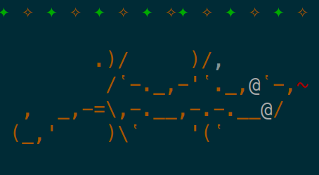

# Gecko 🦎




Gecko displays a line of text, with colours. Use it where you would normally use `echo`.

## Usage

```
gecko "hello world" --bg-red
gecko --help
```

### Stability Index

2, Evolving - This project is healthy, but might lack testing or documentation or it is prone to breaking changes

### Build

```
go build
go install
```
Run tests
```
go build
go test
```

Run benchmarks
```
go build
go test -bench=.
```

### Installation

```sh
git clone git@github.com:rgrannell1/gecko.git
cd gecko
go build
go install
```
verify the install with

```sh
which gecko
```

### Files

```
.github/workflows/ci.yaml // -- github actions to run tests
.gitignore                // -- specifies git-ignored files
README.md                 // -- the readme file
example.png               // -- an example image
go.mod                    // -- module definition
go.sum                    // -- project sum
main.go                   // -- the program itself
main_test.go              // -- tests and benchmarks for the project
```

### License

The MIT License

Copyright (c) 2020 Róisín Grannell

Permission is hereby granted, free of charge, to any person obtaining a copy of this software and associated documentation files (the "Software"), to deal in the Software without restriction, including without limitation the rights to use, copy, modify, merge, publish, distribute, sublicense, and/or sell copies of the Software, and to permit persons to whom the Software is furnished to do so, subject to the following conditions:

The above copyright notice and this permission notice shall be included in all copies or substantial portions of the Software.

THE SOFTWARE IS PROVIDED "AS IS", WITHOUT WARRANTY OF ANY KIND, EXPRESS OR IMPLIED, INCLUDING BUT NOT LIMITED TO THE WARRANTIES OF MERCHANTABILITY, FITNESS FOR A PARTICULAR PURPOSE AND NONINFRINGEMENT. IN NO EVENT SHALL THE AUTHORS OR COPYRIGHT HOLDERS BE LIABLE FOR ANY CLAIM, DAMAGES OR OTHER LIABILITY, WHETHER IN AN ACTION OF CONTRACT, TORT OR OTHERWISE, ARISING FROM, OUT OF OR IN CONNECTION WITH THE SOFTWARE OR THE USE OR OTHER DEALINGS IN THE SOFTWARE.
